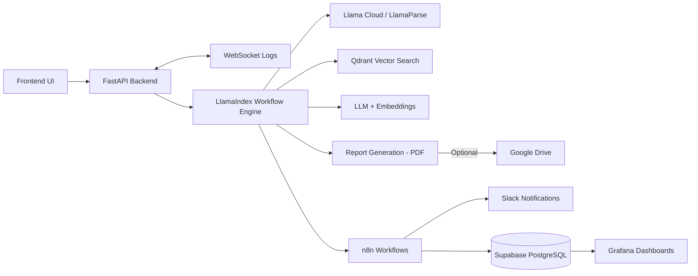

# Candidate-Resume-Screening-Pipeline-LlamaIndex-n8n-Grafana

Production-ready AI pipeline that parses resumes and application forms, matches candidate data to structured fields, and delivers confidence-scored outputs with human-in-the-loop validation. The system combines LlamaIndex workflows, Llama Cloud parsing, n8n automation, and Grafana-style observability for end-to-end visibility.

## What This Project Does

- Ingests a resume (PDF) and a structured application form
- Extracts and matches candidate data to required fields using RAG workflows
- Provides confidence scores and human review checkpoints
- Generates a PDF report and optionally uploads it to Google Drive
- Emits monitoring payloads to n8n for downstream automation and analytics
- Drives n8n workflows that post live, request-level insights to Slack during processing
- Persists workflow metrics and results to a Supabase-hosted PostgreSQL database
- Powers Grafana dashboards on top of PostgreSQL for real-time and historical visibility


Uploading Video_last.mp4…


## Architecture Overview



## Key Components

- **Backend (FastAPI)**: Session lifecycle, file upload, workflow execution, and WebSocket logs.
- **Workflow Engine (LlamaIndex)**: Parsing, retrieval, field matching, confidence scoring, and feedback loops.
- **Vector Store (Qdrant)**: Semantic retrieval against parsed resume content.
- **Automation (n8n)**: Analytics reporting and workflow triggers via webhook payloads.
- **Frontend (React)**: UI for configuring runs, monitoring progress, and submitting feedback.

## Repository Structure

```text
backend/
	app/                  # FastAPI app, routers, session management
	workflow/             # LlamaIndex workflow engine and monitoring
	n8n_worflow/          # n8n import template (folder name preserved)
	n8n_workflows/        # Example generated monitoring reports
	sql_queries/          # Analytics queries for dashboards
	uploads/              # Runtime artifacts (generated)
	main.py               # Backend entrypoint
	pyproject.toml        # Python project and dependencies (managed by uv)
	uv.lock               # Reproducible dependency lockfile
frontend/
	src/                  # React UI
	public/               # Static assets
	package.json          # Frontend scripts and dependencies
```

## Quick Start

### Backend

Install [uv](https://docs.astral.sh/uv/getting-started/installation/) first, then run:

```bash
cd backend
uv sync
uv run playwright install chromium
uv run python main.py
```

API defaults to `http://0.0.0.0:8000`.

### Frontend

```bash
cd frontend
npm install
npm start
```

UI defaults to `http://localhost:3000`.

## Environment Configuration

Create a `.env` file in `backend/` and set the required provider keys and endpoints:

- `LLAMA_PARSE_API_KEY`
- `QDRANT_API_KEY`
- `QDRANT_CLUSTER_ENDPOINT`
- `N8N_WEBHOOK_URL`
- `N8N_WEBHOOK_ENABLED`
- `GOOGLE_API_KEY` (if using Google providers)
- `AZURE_API_KEY`, `AZURE_ENDPOINT` (if using Azure OpenAI)
- `AZURE_EMBED_API_KEY`, `AZURE_EMBED_ENDPOINT`
- `GOOGLE_DRIVE_FOLDER_ID` (optional)

For Google Drive setup, see [backend/SETUP_GOOGLE_DRIVE.md](backend/SETUP_GOOGLE_DRIVE.md).

## Workflow Lifecycle

1. Create a session with runtime configuration.
2. Upload resume and application form.
3. Start the workflow.
4. Stream logs and status updates.
5. Review confidence-scored results.
6. Submit feedback when required.
7. Export results and PDF report.

## API Overview

Core endpoints are documented in [backend/README.md](backend/README.md). Common routes:

- `POST /api/sessions`
- `POST /api/sessions/{session_id}/upload`
- `POST /api/sessions/{session_id}/start`
- `GET /api/sessions/{session_id}/status`
- `POST /api/sessions/{session_id}/feedback`
- `GET /api/sessions/{session_id}/results`

## Observability and Reporting

- **n8n**: Receives execution telemetry and report payloads for automation.
- **Grafana-style analytics**: SQL queries are available in `backend/sql_queries/`.

## Security Notes

- Do not commit secrets, OAuth credentials, or uploaded resumes.
- Clear `backend/uploads/` before sharing or deploying.
- Rotate any keys that were ever committed to Git.

## Related Documentation

- [backend/README.md](backend/README.md)
- [backend/workflow/README.md](backend/workflow/README.md)
- [frontend/README.md](frontend/README.md)

## License

See [LICENSE](LICENSE).
