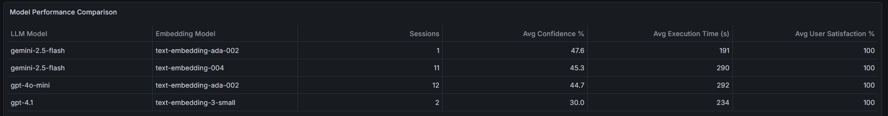
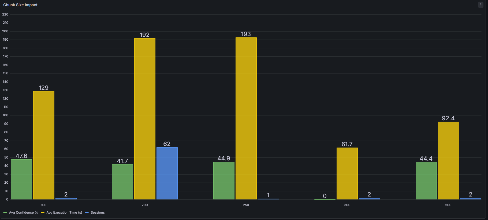
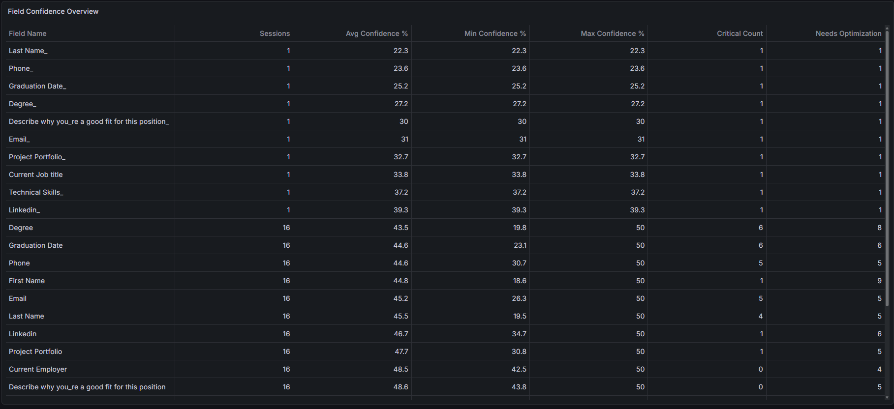
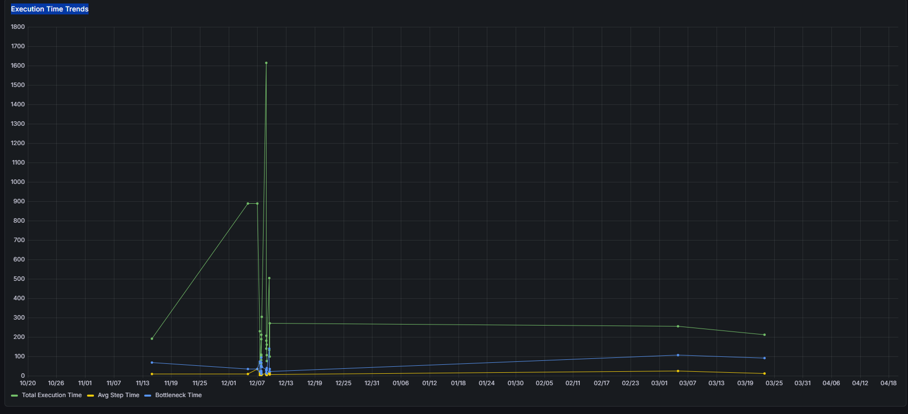

# Grafana Dashboards and SQL Queries

This document centralizes the SQL queries used to power key Grafana panels for RAG analytics monitoring.

## Contents

1. Model Performance Comparison
2. Chunk Size Impact
3. Field Confidence Overview
4. Execution Time Trends

---

## 1. Model Performance Comparison

**Purpose**  
Compare LLM and embedding model combinations by confidence, execution performance, and user satisfaction.

**SQL Query**

```sql
SELECT
  llm_model AS "LLM Model",
  embedding_model AS "Embedding Model",
  COUNT(*) AS "Sessions",
  ROUND(AVG(overall_confidence) * 100, 2) AS "Avg Confidence %",
  ROUND(AVG(execution_time), 2) AS "Avg Execution Time (s)",
  ROUND(AVG(user_satisfaction), 1) AS "Avg User Satisfaction %"
FROM rag_analytics.session_logs
WHERE $__timeFilter(timestamp)
GROUP BY llm_model, embedding_model
ORDER BY "Avg Confidence %" DESC;
```

**Dashboard Preview**



---

## 2. Chunk Size Impact

**Purpose**  
Evaluate the effect of chunk size on confidence and runtime efficiency.

**SQL Query**

```sql
SELECT
  chunk_size::text AS "Chunk Size",
  ROUND(AVG(overall_confidence) * 100, 2) AS "Avg Confidence %",
  ROUND(AVG(execution_time), 2) AS "Avg Execution Time (s)",
  COUNT(*) AS "Sessions"
FROM rag_analytics.session_logs
WHERE $__timeFilter(timestamp)
  AND chunk_size > 0
GROUP BY chunk_size
ORDER BY chunk_size;
```

**Dashboard Preview**



---

## 3. Field Confidence Overview

**Purpose**  
Track field-level confidence, identify risky fields, and surface optimization opportunities.

**SQL Query**

```sql
SELECT
  field_name AS "Field Name",
  COUNT(*) AS "Sessions",
  ROUND(AVG(avg_confidence) * 100, 2) AS "Avg Confidence %",
  ROUND(MIN(avg_confidence) * 100, 2) AS "Min Confidence %",
  ROUND(MAX(avg_confidence) * 100, 2) AS "Max Confidence %",
  COUNT(CASE WHEN health_status = 'CRITICAL' THEN 1 END) AS "Critical Count",
  COUNT(CASE WHEN needs_optimization = true THEN 1 END) AS "Needs Optimization"
FROM rag_analytics.field_analytics
WHERE $__timeFilter(timestamp)
GROUP BY field_name
ORDER BY "Avg Confidence %" ASC;
```

**Dashboard Preview**



---

## 4. Execution Time Trends

**Purpose**  
Monitor runtime behavior over time and detect system bottlenecks.

**SQL Query**

```sql
SELECT
  timestamp AS "time",
  execution_time AS "Total Execution Time",
  average_step_time AS "Avg Step Time",
  bottleneck_time AS "Bottleneck Time"
FROM rag_analytics.session_logs
WHERE $__timeFilter(timestamp)
ORDER BY timestamp;
```

**Dashboard Preview**




## ... and many more dashboards
